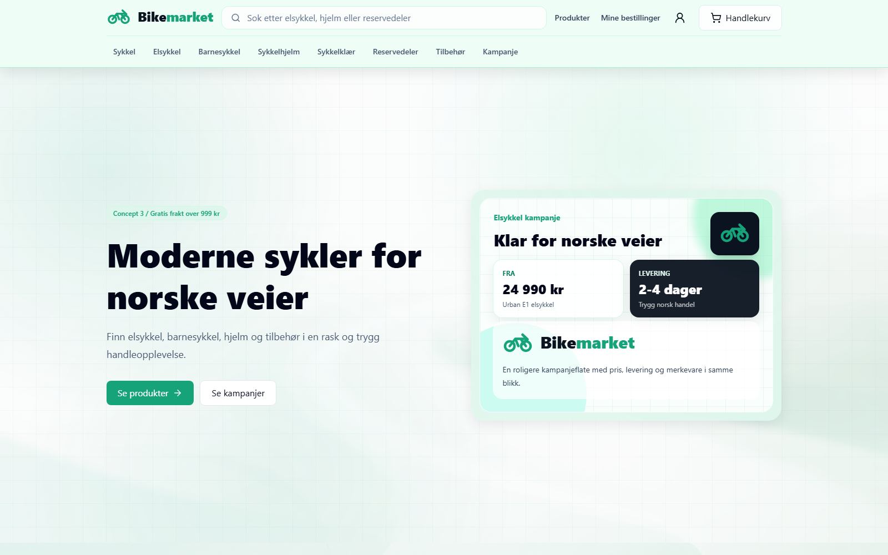
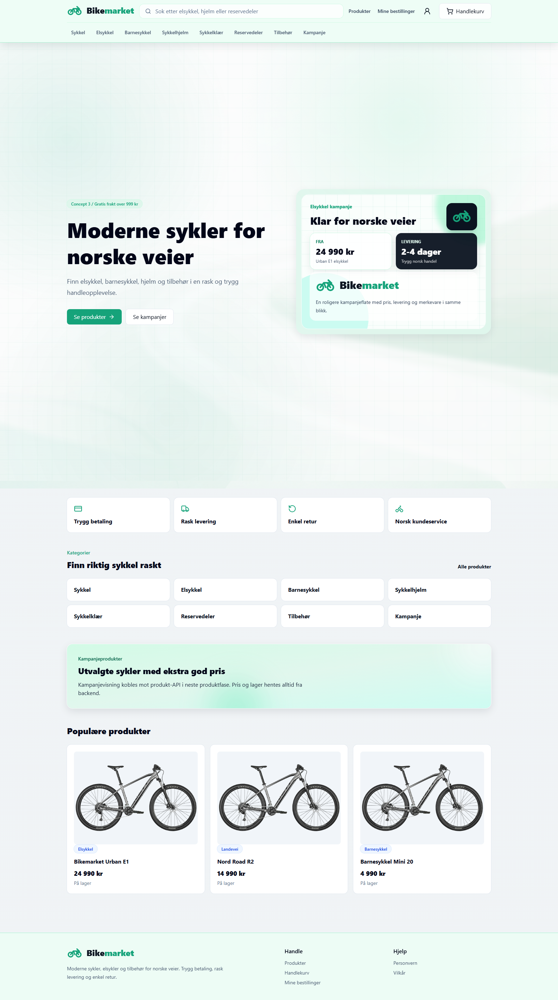

# Bikemarket

Bikemarket is a Norwegian bicycle marketplace built as a TypeScript monorepo. It includes a React storefront, an
Express API, PostgreSQL persistence through Prisma, cart and checkout flows, admin-protected catalog management, and
deployment scripts for a Docker-based VPS setup.





## What Is Included

- Storefront for bicycles, e-bikes, kids bikes, helmets, clothing, parts, accessories, and campaigns.
- Backend catalog, authentication, cart, checkout, order, payment, and admin APIs.
- PostgreSQL schema, migrations, Prisma Client, and seed data.
- Mock payment flow plus Stripe, Vipps, and Klarna-ready provider structure.
- Docker Compose files for local development and production deployment.
- QA coverage for static checks, unit rules, backend API behavior, frontend behavior, security controls, and deployment docs.

## Tech Stack

- Frontend: React, TypeScript, Vite, Tailwind CSS, React Router, TanStack Query, Zustand.
- Backend: Node.js, Express, TypeScript, Zod, JWT auth, bcrypt.
- Database: PostgreSQL with Prisma.
- Payments: provider-based mock, Stripe, Vipps, and Klarna adapters.
- Deployment: Docker, Docker Compose, optional Caddy reverse proxy.
- Tests: Node test runner plus backend TypeScript tests.

## Project Structure

```txt
apps/
  backend/
  frontend/
packages/
  shared/
tests/
Test_old/
docs/
scripts/deployment/
```

## Run Locally

Install dependencies:

```bash
npm install
```

Start PostgreSQL:

```bash
docker compose up -d
```

Prepare the database:

```bash
npm run db:migrate -w @bikemarket/backend -- --name init_ecommerce_schema
npm run db:seed -w @bikemarket/backend
```

Run the app:

```bash
npm run dev
```

Open the frontend:

```txt
http://localhost:1299
```

Useful workspace commands:

```bash
npm run dev -w @bikemarket/backend
npm run dev -w @bikemarket/frontend
npm run db:check -w @bikemarket/backend
```

## Quality Checks

Run the main test suite:

```bash
npm test
```

Run broader verification:

```bash
npm run test:qa
npm run test:legacy
npm run typecheck
npm run build
```

Targeted checks:

```bash
npm run test:static
npm run test:unit
npm run test:api
npm run test:component
npm run test:e2e
npm run test:security
```

## Production

Production deployment is documented in [docs/deployment.md](docs/deployment.md).

The deployment toolkit includes checks and helpers for:

- Server baseline setup.
- DNS and SSL verification.
- Production environment validation.
- Docker Compose validation.
- Migration and seed execution.
- Smoke checks.
- Database backup, restore, and backup freshness checks.
- Operations checks.
- Update and rollback flows.

Common commands:

```bash
npm run deploy:check:server
npm run deploy:check:domain
npm run deploy:check:pre-app
npm run deploy:check:env
npm run deploy:check:compose
npm run deploy:migrate
npm run deploy:check:smoke
npm run deploy:check:pre-backup
```

Production stack:

```bash
cp .env.production.example .env.production
docker compose --env-file .env.production -f docker-compose.prod.yml build
docker compose --env-file .env.production -f docker-compose.prod.yml up -d
```

Production database commands:

```bash
npm run db:migrate:deploy
npm run db:seed
npm run deploy:migrate
```

## Documentation

- [Deployment guide](docs/deployment.md)
- [QA strategy](docs/qa-test-strategy.md)
- [Frontend expectations](docs/frontend-expectations.md)
